# Inferno-AI

<div align="center">

**Autonomous Penetration Testing Agent powered by Claude**

*Think like a hacker. Execute like a machine.*

[](https://www.python.org/downloads/)
[](https://anthropic.com)
[](LICENSE)
[](docs/INSTALL.md)
[](https://discord.gg/P8Uqx5EkaA)

[Installation](#installation) • [Features](#features) • [Architecture](#architecture) • [Documentation](#documentation)

</div>

---

Inferno is an AI-powered security testing agent that uses Claude to autonomously perform penetration testing, vulnerability discovery, and security assessments. Unlike traditional scanners that blindly run checks, Inferno **thinks like a human pentester** - it adapts strategies, chains vulnerabilities, validates findings, and learns from experience.

```
┌────────────────────────────────────────────────────────────────────────────┐
│  "Found SQLi in /api/users endpoint. Let me check if I can escalate       │
│   this to dump credentials and pivot to the admin panel..."               │
│                                                          - Inferno Agent  │
└────────────────────────────────────────────────────────────────────────────┘
```

## Features

### Core Capabilities

| Feature | Description |
|---------|-------------|
| **Autonomous Reasoning** | Claude-powered decision making that adapts to each target |
| **Multi-Agent Swarm** | Coordinated specialist agents working in parallel |
| **Persistent Memory** | Learns from past assessments, remembers what worked |
| **Vulnerability Chaining** | Automatically escalates and chains findings |
| **Bug Bounty Reports** | Generates professional, submission-ready reports |

### What Makes Inferno Different

<table>
<tr>
<td width="50%">

#### Traditional Scanners
```
❌ Run predefined checks blindly
❌ Generate thousands of false positives
❌ No understanding of context
❌ Can't chain vulnerabilities
❌ Same approach for every target
```

</td>
<td width="50%">

#### Inferno
```
✅ Reasons about each target uniquely
✅ Validates before reporting
✅ Understands application logic
✅ Chains vulns → real impact
✅ Adapts strategy dynamically
```

</td>
</tr>
</table>

---

## Feature Highlights

### 1. Claude Code OAuth Integration (Zero Extra Cost)

**First pentest agent to reuse your Claude subscription.** Inferno automatically uses your existing Claude authentication - no API key billing.

```bash
# macOS: Automatic via Keychain
claude login  # Done once
inferno shell
# → "Using OAuth token from macOS Keychain"

# Windows/Linux: Set via environment variable
export CLAUDE_CODE_OAUTH_TOKEN=sk-ant-oat01-...
inferno shell
# → "Using OAuth token from environment"
```

### 2. Minimalist Tool Architecture

**5 tools instead of 81.** The LLM already knows security tools - we just let it run commands.

```mermaid
flowchart LR
    subgraph Core["THE 5 CORE TOOLS"]
        direction TB
        EXEC["⚡ execute_command<br/>(Primary Tool)"]
        HTTP["🌐 http_request<br/>Auth • Proxies • Sessions"]
        MEM["🧠 memory<br/>Store • Recall • Learn"]
        THINK["💭 think<br/>Structured Reasoning"]
        SWARM["🐝 swarm<br/>Spawn Sub-Agents"]
    end

    subgraph Commands["The Agent Decides What to Run"]
        C1["nmap -sV -sC target.com"]
        C2["sqlmap -u 'http://...' --batch"]
        C3["gobuster dir -u http://..."]
        C4["nuclei -u http://... -t cves/"]
        C5["Any command it needs"]
    end

    EXEC --> C1 & C2 & C3 & C4 & C5
```



**Why this works:** Claude already knows nmap, sqlmap, gobuster, hydra, and hundreds of other tools. Forcing it to select from 81 specialized wrappers creates cognitive overhead. Just let it run the command it wants.

### 3. Meta Agent with Swarm-on-Demand

The **Meta Agent** does the work directly, and spawns specialized sub-agents when it needs help:

```mermaid
flowchart TB
    subgraph MetaAgent["META AGENT (Main)"]
        MA["🧠 Autonomous Agent<br/>Reasons • Plans • Executes"]
        TOOLS["4 Core Tools<br/>execute_command • http_request<br/>memory • think"]
        SWARM["🐝 swarm tool<br/>Spawn specialists on demand"]
    end

    subgraph Workers["SPAWNED SUB-AGENTS (On Demand)"]
        direction LR
        W1["🔍 Recon"]
        W2["🎯 Scanner"]
        W3["💥 Exploiter"]
        W4["🛡️ WAF Bypass"]
        W5["✅ Validator"]
        W6["📝 Reporter"]
    end

    subgraph Memory["SHARED MEMORY"]
        MEM[("Qdrant + Mem0<br/>All agents share context")]
    end

    MA --> TOOLS
    MA --> SWARM
    SWARM -->|"needs recon"| W1
    SWARM -->|"needs scanning"| W2
    SWARM -->|"needs exploitation"| W3
    SWARM -->|"WAF detected"| W4
    SWARM -->|"validate finding"| W5
    SWARM -->|"generate report"| W6

    W1 & W2 & W3 & W4 & W5 & W6 --> MEM
    MA <--> MEM
```



**How it works:**
1. **Meta Agent receives task** - "Find vulnerabilities in target.com"
2. **Meta Agent works directly** - Uses `execute_command` to run nmap, gobuster, etc.
3. **Meta Agent spawns help when needed** - Uses `swarm` tool to delegate:
   - "I found a potential SQLi, spawn an **Exploiter** to confirm and extract data"
   - "WAF is blocking me, spawn a **WAF Bypass** specialist"
   - "Need deeper recon, spawn a **Recon** agent for subdomain enum"
4. **Sub-agents return results** - Meta Agent continues with new intelligence
5. **Shared Memory** - All agents read/write to same Qdrant collection

### 4. Persistent Memory System

Inferno remembers everything across sessions:

```python
# Session 1: Initial recon
inferno> target https://app.example.com
inferno> run
# Found: Admin panel at /admin, WAF detected, PHP backend

# Session 2: Continued testing (days later)
inferno> target https://app.example.com
inferno> run
# Agent recalls: "I previously found an admin panel and WAF.
#                Let me try WAF bypass techniques on /admin..."
```

**Memory includes:**
- Discovered endpoints and parameters
- Successful exploitation techniques
- Failed approaches (won't repeat)
- Collected credentials
- Technology fingerprints

### 5. Intelligent Guardrails

Built-in safety without limiting capability:

```mermaid
flowchart LR
    subgraph Guards["SECURITY GUARDRAILS"]
        direction TB
        G1["✓ Scope Enforcement<br/>Only tests authorized targets"]
        G2["✓ Dangerous Cmd Blocking<br/>Prevents rm -rf /, fork bombs"]
        G3["✓ Credential Leak Detection<br/>Catches secret exposure"]
        G4["✓ Unicode Homograph Guard<br/>Blocks sneaky bypasses"]
        G5["✓ Rate Limiting<br/>Adaptive throttling per domain"]
        G6["✓ Prompt Injection Defense<br/>Sanitizes untrusted input"]
    end
```



### 6. Bug Bounty Report Generation

Automatically generates submission-ready reports:

```markdown
## Vulnerability: SQL Injection in User Search

**Severity:** High (CVSS 8.6)
**Endpoint:** POST /api/v2/users/search
**Parameter:** `query`

### Description
The `query` parameter is vulnerable to SQL injection...

### Proof of Concept
curl -X POST https://target.com/api/v2/users/search \
  -d "query=admin' OR '1'='1"

### Impact
- Full database access
- User credential theft
- Potential RCE via SQL functions

### Remediation
Use parameterized queries...
```

### 7. Adaptive Execution

The agent adapts its approach based on what it discovers:

```
Discovery                    →  Adaptation
─────────────────────────────────────────────────────────
WAF detected (Cloudflare)    →  Switch to WAF bypass techniques
PHP backend found            →  Focus on PHP-specific vulns
API endpoints discovered     →  Test for IDOR, auth bypass
Credentials found            →  Attempt credential reuse
Rate limiting hit            →  Slow down, rotate user agents
```

### 8. Decision Tracking & Backtracking

Never gets stuck in loops. Tracks every decision point:

```mermaid
flowchart TB
    subgraph BT["BRANCH TRACKER"]
        direction TB
        R["[1] Initial Recon"]
        R1["[1.1] Port scan<br/>→ Found 80, 443, 8080"]
        R2["[1.2] Subdomain enum<br/>→ Found api., admin., dev."]

        W["[2] Web Testing"]
        W1["[2.1] Directory brute<br/>→ Found /admin (403)"]
        W2["[2.2] Parameter fuzzing<br/>→ Found SQLi candidate"]
        W3["[2.3] SQLi exploitation<br/>→ CONFIRMED ✓"]

        A["[3] API Testing"]
        A1["[3.1] Endpoint discovery<br/>→ 15 endpoints"]
        A2["[3.2] Auth testing<br/>→ IDOR found ✓"]
    end

    R --> R1 & R2
    W --> W1 --> W2 --> W3
    A --> A1 & A2
```



---

## Quick Start

### Installation

#### macOS / Linux (Native)

```bash
# Clone the repository
git clone https://github.com/Adem035/Inferno.git
cd Inferno

# Create virtual environment
python -m venv venv
source venv/bin/activate

# Install Inferno
pip install -e .

# Start Qdrant (memory backend)
docker run -d -p 6333:6333 qdrant/qdrant

# Setup (validates environment, installs tools)
inferno setup
```

#### Windows / Cross-Platform (Docker - Recommended)

All security tools included - nothing else to install!

```powershell
# Clone the repository
git clone https://github.com/Adem035/Inferno.git
cd Inferno

# Create .env file with your authentication
copy .env.example .env
# Edit .env and add: CLAUDE_CODE_OAUTH_TOKEN=sk-ant-oat01-... (or ANTHROPIC_API_KEY)

# Start Inferno with all tools
docker-compose up -d

# Enter the container
docker-compose exec inferno bash
inferno shell
```

### Authentication

**Option 1: Claude Code OAuth (FREE with Claude subscription)**
```bash
# macOS: Automatic via Keychain
claude login
inferno shell

# Windows/Linux: Set environment variable
export CLAUDE_CODE_OAUTH_TOKEN=sk-ant-oat01-...
inferno shell
```

**Option 2: API Key**
```bash
export ANTHROPIC_API_KEY=sk-ant-...
inferno shell
```

### Basic Usage

```bash
# Start interactive shell
inferno shell

# Set target and run
inferno> target https://example.com
inferno> objective Find security vulnerabilities
inferno> run

# Generate report
inferno> report --format markdown
```

---

## Architecture

```mermaid
flowchart TB
    subgraph User["USER INTERFACE"]
        CLI["CLI Shell<br/>inferno shell"]
    end

    subgraph MetaAgent["META AGENT"]
        EXEC["SDKExecutor<br/>Autonomous Reasoning"]
        CLAUDE["Claude API<br/>Opus 4.5"]

        subgraph Tools["5 CORE TOOLS"]
            CMD["⚡ execute_command"]
            HTTP["🌐 http_request"]
            MEM_T["🧠 memory"]
            THINK["💭 think"]
            SWARM["🐝 swarm"]
        end
    end

    subgraph Workers["SPAWNED SUB-AGENTS"]
        direction LR
        W1["Recon"]
        W2["Scanner"]
        W3["Exploiter"]
        W4["WAF Bypass"]
        W5["Validator"]
        W6["Reporter"]
    end

    subgraph Intel["INTELLIGENT EXPLOITATION ENGINE"]
        direction LR
        HINT["Hint<br/>Extractor"]
        RESP["Response<br/>Analyzer"]
        DIFF["Differential<br/>Analyzer"]
        MUT["Payload<br/>Mutator"]
        ATK["Attack<br/>Selector"]
        VAL["Validation<br/>Gate"]
    end

    subgraph Safety["SAFETY LAYER"]
        SCOPE["Scope Manager"]
        GUARD["Guardrails"]
        BRANCH["Branch Tracker"]
    end

    subgraph Storage["SHARED MEMORY"]
        QDRANT[("Qdrant + Mem0<br/>Persistent Knowledge")]
    end

    subgraph External["SECURITY TOOLS"]
        TOOLS["nmap • sqlmap • gobuster<br/>nuclei • hydra • nikto • ffuf"]
    end

    CLI --> EXEC
    EXEC <--> CLAUDE
    EXEC --> Tools
    CMD --> TOOLS

    SWARM -->|"spawn on demand"| Workers
    Workers --> Tools

    EXEC --> Intel
    Intel --> MUT

    Tools --> Safety
    EXEC <--> QDRANT
    Workers --> QDRANT
```



### Component Overview

| Component | Purpose |
|-----------|---------|
| **CLI Shell** | Interactive command interface |
| **Meta Agent (SDKExecutor)** | Main autonomous agent - reasons, plans, executes |
| **5 Core Tools** | execute_command, http_request, memory, think, **swarm** |
| **Swarm Tool** | Spawns specialized sub-agents on demand |
| **Sub-Agents** | Specialists: Recon, Scanner, Exploiter, WAF Bypass, Validator, Reporter |
| **Shared Memory (Qdrant)** | All agents share context via vector database |
| **Scope Manager** | Enforces authorized testing boundaries |
| **Guardrails** | Security policies and safety checks |
| **Branch Tracker** | Decision tracking and backtracking |

### Intelligent Exploitation Engine

```mermaid
flowchart LR
    subgraph Input["INPUT"]
        REQ["HTTP Response"]
        BLOCK["Blocked Request"]
        TECH["Technology Stack"]
    end

    subgraph Engine["INTELLIGENT EXPLOITATION ENGINE"]
        direction TB
        HINT["🔍 Hint Extractor<br/>HTML comments • Errors<br/>Tech fingerprints"]
        RESP["🛡️ Response Analyzer<br/>WAF Detection<br/>CloudFlare • AWS • ModSec"]
        DIFF["📊 Differential Analyzer<br/>Boolean-based detection<br/>Time-based blind"]
        MUT["🔄 Payload Mutator<br/>Encoding • Case mixing<br/>HPP • Comments"]
        ATK["🎯 Attack Selector<br/>Tech → Attack mapping<br/>Learning from history"]
        VAL["✅ Validation Gate<br/>Re-exploit to confirm<br/>Zero false positives"]
    end

    subgraph Output["OUTPUT"]
        BYPASS["Bypass Payloads"]
        PLAN["Attack Plan"]
        CONF["Confirmed Finding"]
    end

    REQ --> HINT --> ATK
    BLOCK --> RESP --> MUT --> BYPASS
    TECH --> ATK --> PLAN
    REQ --> DIFF --> VAL --> CONF
```



| Component | Purpose |
|-----------|---------|
| **Hint Extractor** | Extracts hints from HTML comments, errors, headers. Detects PHP, Node, Python, Java fingerprints. |
| **Response Analyzer** | Detects WAFs (CloudFlare, AWS, ModSecurity, etc.) and suggests targeted bypass techniques. |
| **Differential Analyzer** | Compares responses for blind injection detection (boolean-based, time-based). |
| **Payload Mutator** | Auto-generates bypass payloads: encoding, case mixing, comment injection, HPP. |
| **Attack Selector** | Maps detected technologies to prioritized attack vectors. Learns from success/failure. |
| **Validation Gate** | Re-exploits findings to confirm before reporting. Eliminates false positives. |

---

## Documentation

| Document | Description |
|----------|-------------|
| [Installation Guide](docs/INSTALL.md) | Detailed setup for all platforms |
| [Authentication](docs/AUTHENTICATION.md) | OAuth, API keys, Claude Code integration |
| [Configuration](docs/CONFIGURATION.md) | Environment variables and settings |
| [Security Tools](docs/TOOLS.md) | External tool requirements |
| [Usage Guide](docs/USAGE.md) | CLI commands and examples |
| [Contributing](CONTRIBUTING.md) | How to contribute |

---

## Requirements

| Requirement | Minimum | Recommended |
|-------------|---------|-------------|
| **OS** | macOS 12+, Ubuntu 22.04+, Windows 10+, Kali | Any (Docker equalizes experience) |
| **Python** | 3.11 (native) or Docker | 3.12 |
| **RAM** | 8 GB | 16 GB |
| **Docker** | Required | Required |

### Platform Support

| Platform | Installation | Security Tools | OAuth |
|----------|-------------|----------------|-------|
| **macOS** | Native or Docker | brew install | Automatic (Keychain) |
| **Ubuntu/Debian** | Native or Docker | apt install | ENV variable |
| **Kali Linux** | Native or Docker | Pre-installed | ENV variable |
| **Windows 11** | Docker (recommended) | All included | ENV variable |
| **Windows 10** | Docker or WSL2 | All included | ENV variable |

---

## Security Notice

```
╔═══════════════════════════════════════════════════════════════════════════╗
║  ⚠️  AUTHORIZED SECURITY TESTING ONLY                                     ║
║                                                                           ║
║  Inferno is designed for legitimate security testing. Always ensure you  ║
║  have explicit written permission before testing any target.             ║
║                                                                           ║
║  Unauthorized access to computer systems is illegal and unethical.       ║
╚═══════════════════════════════════════════════════════════════════════════╝
```

---

## Current Capabilities

### Exploitation Modules (Built-in)

| Category | Techniques |
|----------|------------|
| **Injection** | SQLi (Union, Blind, Time-based), NoSQLi, Command Injection, LDAP, XPath |
| **XSS** | Reflected, Stored, DOM-based, Filter bypass, Context-aware payloads |
| **SSRF** | Internal service access, Cloud metadata, Protocol smuggling |
| **Authentication** | Brute force, Credential stuffing, Session hijacking, JWT attacks |
| **Access Control** | IDOR, Privilege escalation, Path traversal, Function-level bypass |
| **Deserialization** | Java, PHP, Python, .NET unsafe deserialization |
| **SSTI** | Jinja2, Twig, Freemarker, Velocity template injection |
| **File Attacks** | LFI, RFI, Unrestricted upload, XXE |
| **Business Logic** | Race conditions, Price manipulation, Workflow bypass |

### API Security Module

| Category | Techniques |
|----------|------------|
| **GraphQL** | Introspection, BOLA/IDOR, Batch attacks, Query complexity DoS, Field suggestions |
| **REST API** | Endpoint enumeration, Mass assignment, Parameter pollution, Method testing |
| **OpenAPI/Swagger** | Spec discovery, Schema parsing, Attack surface mapping, Internal endpoint exposure |
| **API Auth** | JWT algorithm confusion, None algorithm, Weak secret brute force, OAuth flow attacks |
| **Rate Limiting** | Header spoofing bypass, Endpoint variation, Resource exhaustion, Cost attacks |
| **Business Logic** | Workflow bypass, Price manipulation, Race conditions, Currency confusion |
| **Data Exposure** | Excessive data in responses, Verbose errors, Metadata leakage, Debug endpoints |

### Reconnaissance Modules

| Category | Tools/Techniques |
|----------|------------------|
| **Port Scanning** | nmap, masscan, rustscan |
| **Subdomain Enum** | subfinder, amass, DNS brute |
| **Web Discovery** | gobuster, ffuf, feroxbuster |
| **Tech Detection** | whatweb, wappalyzer, fingerprinting |
| **Vulnerability Scan** | nuclei, nikto, CVE lookup |

---

## Roadmap

### Completed
- [x] Core agent architecture
- [x] Claude Code OAuth integration
- [x] Multi-agent swarm coordination
- [x] Persistent memory system
- [x] Bug bounty report generation
- [x] Security guardrails
- [x] Web exploitation (OWASP Top 10)
- [x] CTF solver persona
- [x] **API Security Module** - GraphQL introspection, REST fuzzing, OpenAPI parsing, JWT attacks, OAuth testing

### In Progress
- [ ] **Mobile Backend Testing** - Firebase misconfig, API key extraction
- [ ] **Cloud Security** - AWS/GCP/Azure misconfigurations, S3 bucket enum

### Planned
- [ ] **Web UI Dashboard** - Real-time assessment monitoring
- [ ] **Active Directory** - Kerberoasting, AS-REP roasting, BloodHound integration
- [ ] **Network Pivoting** - SSH tunneling, SOCKS proxies, lateral movement
- [ ] **Wireless** - WPA/WPA2 attacks, Evil twin, Deauth
- [ ] **Binary Exploitation** - Buffer overflow assistance, ROP chain building
- [ ] **CI/CD Integration** - GitHub Actions, GitLab CI pipeline scanning
- [ ] **Reporting API** - Export to Jira, DefectDojo, custom webhooks

---

## Community

Join our Discord to connect with other security researchers, get help, and contribute to development:

[](https://discord.gg/P8Uqx5EkaA)

---

## License

This project is licensed under the MIT License - see the [LICENSE](LICENSE) file for details.

**Use responsibly. Always obtain proper authorization before security testing.**

---

## Acknowledgments

### Special Thanks

This project stands on the shoulders of giants. Huge credits to the pioneering work that made Inferno possible:

| Project | Contribution |
|---------|--------------|
| **[Cyber-AutoAgent](https://github.com/westonbrown/Cyber-AutoAgent)** | Groundbreaking work on agent-based security automation and multi-step exploitation chains. |
| **[Strix](https://github.com/usestrix/strix)** | Innovative techniques for LLM-driven vulnerability discovery and security reasoning. |

These projects demonstrated that AI agents could think like security researchers - Inferno builds on their vision.

### Also Thanks To

- [Anthropic](https://anthropic.com) - Claude AI
- [Qdrant](https://qdrant.tech) - Vector search engine
- [Mem0](https://mem0.ai) - Memory layer
- The security research community

---

<div align="center">

**Built for security researchers, by security researchers.**

*Inferno-AI - Think like a hacker. Execute like a machine.*

</div>
